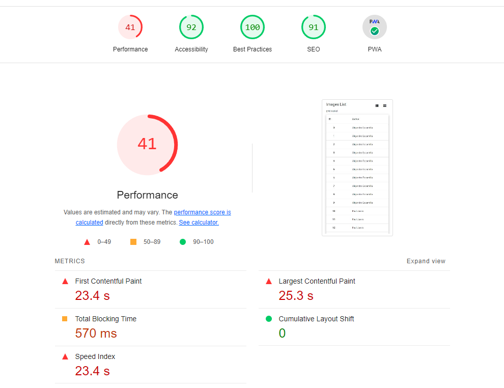

# INFORME GENERADO POR LIGHTHOUSE

Se ha generado el informe de auditoria del proyecto mediante LightHouse.
A continuación enseñamos los resultados obtenidos:

Con estos resultados, podemos concluir que a nivel de Accesibilidad, buenas practicas y seo, los resultado son buenos ya que superamos el rango de los 90/100.
Sin embargo, podemos ver que tenemos problemas a nivel de "performance". Vamos a analizar los puntos mejorables.

# COMENTARIOS

Se ha realizado el deploymente mediante GitHub page, funcionaba correctamente la PWA, se podia ver en el navegador y en el movil y se podia descargar. Sin embargo, despues de unos dias, al querer visitar de nuevo el proyecto, no funcionaba en remoto. En local, el proyecto sigue funcionando bien. No se ha podido arreglar los fallos presente en el deployment.
